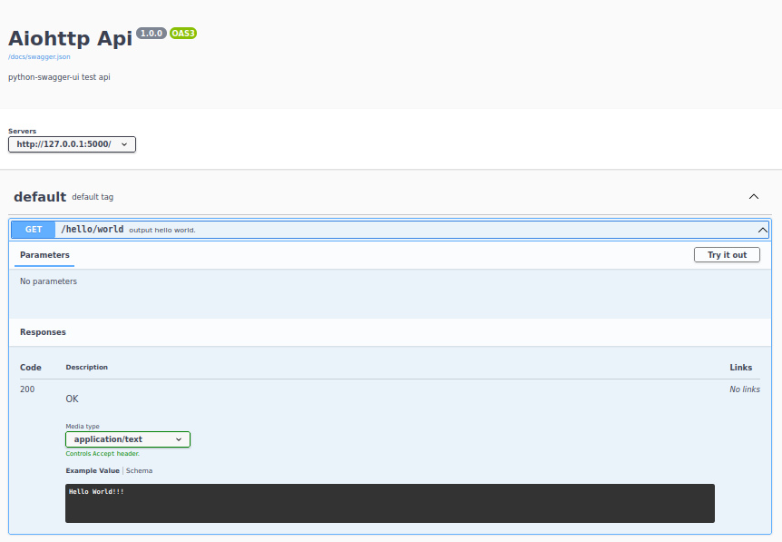

Aiohttp app 
===========

### Venv:
###### python3.9
###### /aiohttp_app
```
python -m venv .venv && \
source .venv/bin/activate && \
pip install -U pip && \
pip install -r requirements.txt
```
### Run:
###### /aiohttp_app
```
python app.py \
  --mode init && \
adev runserver \
  --host "127.0.0.1" \
  --port 5000 \
  --livereload
```
### Tests:
###### /
- ###### Molotov
    ```
    molotov molotov.py -p 4 -w 5 -d 60
    ```
- ###### Init db
    ```
    python app.py --mode init
    ```
- ###### Test dal
    ```
    python app.py --mode dal
    ```  
### Docker:
###### /aiohttp_app
```
docker build -t aiohttp_app . && \
docker run -it --rm -p 5000:5000 aiohttp_app && \
docker rmi aiohttp_app --force
```
**Note:** Swagger file in config directory.
###### Help:
- ###### / inside root directory or cd /xxx  
###### [Links:]()
- ###### [Link]()