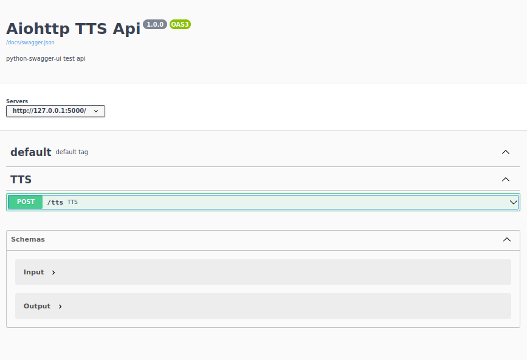

Aiohttp TTS Pytorch app 
=======================

### Venv:
###### python3.9
###### /aiohttp_tts_app
```
python -m venv .venv && \
source .venv/bin/activate && \
pip install -U pip && \
pip install -r requirements.txt
```
### Unpack voices:
```
apt-get install p7zip-full
7za x aiohttp_tts_app/voices/voices.7z.001 -oaiohttp_tts_app/voices/
```
### Run:
###### /
```
adev runserver ./aiohttp_tts_app \                                                                           1 ⨯
  --host "127.0.0.1" \
  --port 5000 \
  --livereload
```

### Tests:
###### /
- ######
    ```
    ```
### Docker:
###### /aiohttp_tts_app
```
docker build -t aiohttp_tts_app . && \
docker run -it --rm -p 5000:5000 aiohttp_tts_app && \
docker rmi aiohttp_app --force
```
**Note:** Swagger files in api directory.
###### Help:
- ###### / inside root directory or cd /xxx  
###### [Links:]()
- ###### [Link]()