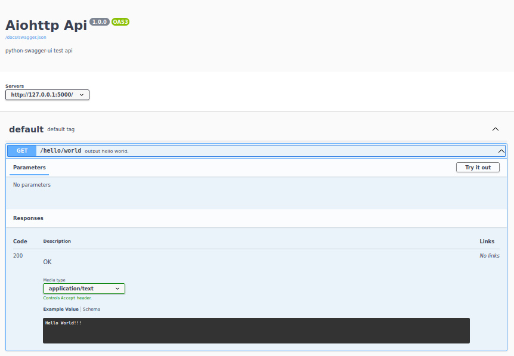

Aiohttp app 
===========

### Venv:
###### python3.9
###### /aiohttpapp
```
python -m venv .venv && \
source .venv/bin/activate && \
pip install -U pip && \
pip install -r requirements.txt
```
### Run:
###### /aiohttpapp
```
adev runserver --livereload --host "127.0.0.1" --port 5000 --livereload
```
### Tests:
###### /
- ###### Test:
    ```
    ```
### Docker:
###### /aiohttpapp
```
docker build -t aiohttpapp . && \
docker run -it --rm -p 5000:5000 aiohttpapp && \
docker rmi aiohttpapp --force
```
**Note:** Swagger file in config directory.
###### Help:
- ###### / inside root directory or cd /xxx  
###### [Links:]()
- ###### [Link]()