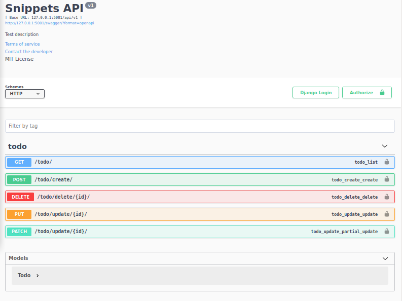

Django Rest Api 
=================

### Venv:
###### python3.9
###### /django_app
```
python -m venv .venv && \
source .venv/bin/activate && \
pip install -U pip && \
pip install -r requirements.txt
```
### Run:
###### /django_app/django_todo
```
python manage.py runserver 127.0.0.1:5001
```
### Make project:
###### /django_app
```
django-admin startproject django_todo && \
cd django_todo && \
python manage.py makemigrations && \
python manage.py migrate && \
python manage.py startapp todo && \ 
python manage.py runserver 127.0.0.1:5001
```
### Migrations:
```
python manage.py makemigrations && \
python manage.py migrate
```
### Tests:
###### /
- ###### Test:
  ```

  ```
### Docker:
###### /djangoapp
```
docker build -t djangoapp . && \
docker run -it --rm -p 5001:5001 djangoapp && \
docker rmi djangoapp --force
```
**Note:** 
###### Help:
- ###### / inside root directory or cd /xxx  
###### [Links:]()
- ###### [Link](https://github.com/axnsan12/drf-yasg) Another Swagger generator...