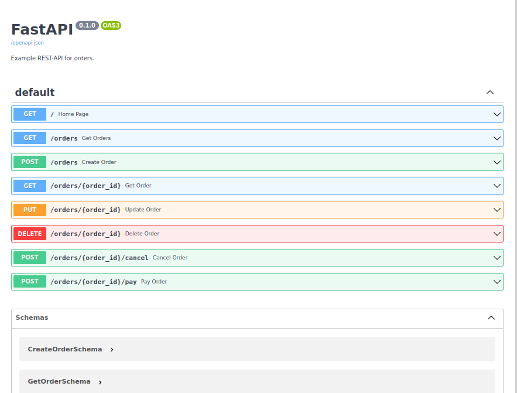

FastApi Rest Api 
=================

### Venv:
###### python3.9
###### /fastapiapp
```
python -m venv .venv && \
source .venv/bin/activate && \
pip install -U pip && \
pip install -r requirements.txt
```
### Run:
###### /fastapiapp
```
uvicorn orders:app --reload --host "127.0.0.1" --port 5002
# OR
sudo uvicorn orders:app --reload --host "127.0.0.1" --port 5002
```
### Tests:
###### /
- ###### Test:
  ```

  ```
### Docker:
###### /fastapiapp
```
docker build -t fastapiapp . && \
docker run -it --rm -p 5002:5002 fastapiapp && \
docker rmi fastapiapp --force
```
**Note:** 
###### Help:
- ###### / inside root directory or cd /xxx  
###### [Links:]()
- ###### [Link]()