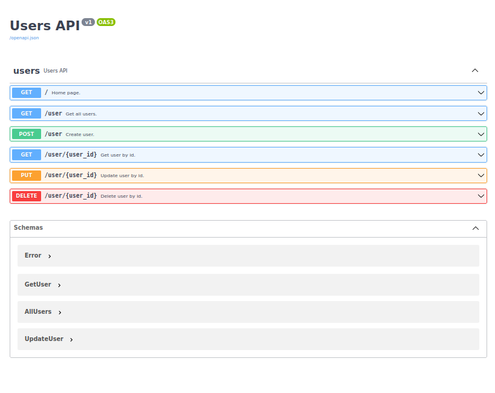

Flask Rest Api 
==============

### Venv:
###### python3.9
###### /flaskapp
```
python -m venv .venv && \
source .venv/bin/activate && \
pip install -U pip && \
pip install -r requirements.txt
```
### Run:
###### /
```
export FLASK_APP=flaskapp.app:app && \
export FLASK_ENV=development && \
export FLASK_RUN_HOST=127.0.0.1 && \
export FLASK_RUN_PORT=5003 && \
flask run --reload
```
### Tests:
###### /
- ###### Test:
  ```

  ```
### Docker:
###### /flaskapp
```
docker build -t flaskapp . && \
docker run -it --rm -p 5003:5003 flaskapp && \
docker rmi flaskapp --force
```
**Note:** 
###### Help:
- ###### / inside root directory or cd /xxx  
###### [Links:]()
- ###### [Link]()