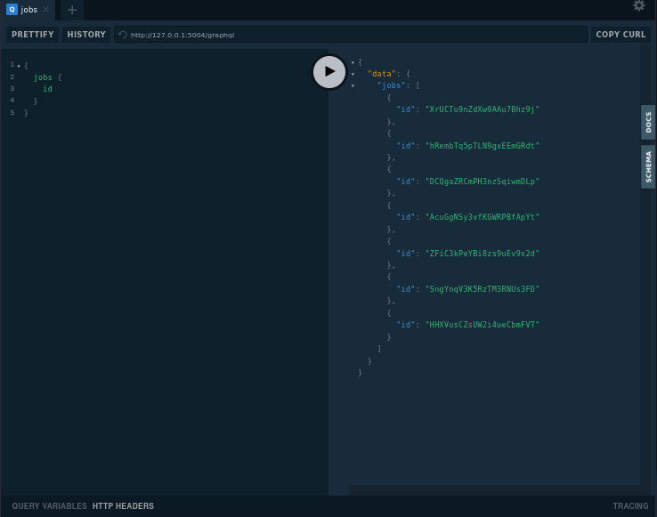

GraphQL + Flask REST-API  
========================

### Venv:
###### Python3.9
###### /graphqlflaskapp
```shell
python -m venv .venv && \
source .venv/bin/activate && \
pip install -U pip && \
pip install -r requirements.txt
```
### Run:
###### /
```
export FLASK_ENV=development && \
export FLASK_APP=graphqlflaskapp.app:app && \
export FLASK_RUN_HOST=127.0.0.1 && \
export FLASK_RUN_PORT=5004 && \
flask run --reload
```
### Database:
###### /
- #### Migrations:
```
export FLASK_APP=graphqlflaskapp.app:app && \
flask db init && \
flask db migrate -m "initial" && \ 
flask db upgrade
```
- #### Tests:
  - ###### Recreate:
    ```
    export FLASK_APP=graphqlflaskapp.app:app && \
    flask init-db
    ```
  - ###### Populate:
    ```
    export FLASK_APP=graphqlflaskapp.app:app && \
    flask test-db 
    ```
  - ###### Testing data access layer:
    ```
    export FLASK_APP=graphqlflaskapp.app:app && \
    flask test-dal
    ```
### Docker:
###### /graphqlflaskapp
```
docker build -t graphqlflaskapp . && \ 
docker run -it --rm -p 5004:5004 graphqlflaskapp && \
docker rmi graphqlflaskapp --force
```
**Note:** 
###### Help:
- ###### / inside root directory or cd /xxx  
###### [Links:]()
- ###### [Link]()