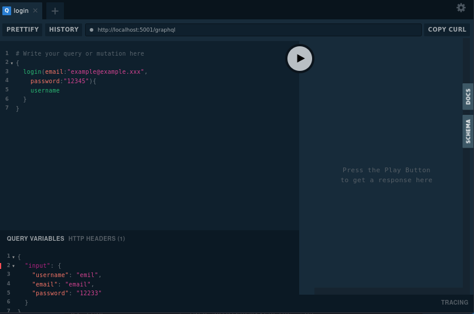

GraphQL + Quart app  
===================

### Venv:
###### python3.9
###### /graphqlquartapp
```
python -m venv .venv && \
source .venv/bin/activate && \
pip install -U pip && \
pip install -r requirements.txt
```
### Run:
###### /
```
export QUART_APP=graphqlquartapp.app:app && \
export QUART_ENV=development && \
quart run -h "127.0.0.1" -p 5005
```
### Click commands:
###### /

- ##### Test async:
  - ##### Future implementations:
    ```
    export QUART_APP=graphqlquartapp.app:app && \
    export QUART_ENV=development && \
    quart test-async
    ```
- ##### Database:
  - ###### Initialize database: 
    ```
    export QUART_APP=graphqlquartapp.app:app && \
    export QUART_ENV=development && \
    quart init-db
    ```
  - ###### Test database:
    ```
    export QUART_APP=graphqlquartapp.app:app && \
    export QUART_ENV=development && \
    quart test-db
    ```
  - ###### Test data access layer:
    ```
    export QUART_APP=graphqlquartapp.app:app && \
    export QUART_ENV=development && \
    quart test-dal      
    ```
### Docker:
###### /graphqlquartapp
```
docker build -t graphqlquartapp . && \
docker run -it --rm -p 5005:5005 graphqlquartapp && \
docker rmi graphqlquartapp --force
```
**Note:** 
###### Help:
- ###### / inside root directory or cd /xxx  
###### [Links:]()
- ###### [Link]()