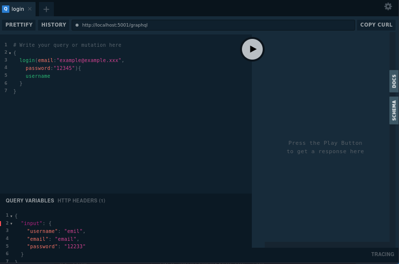

GraphQL Starlette app  
=====================

### Venv:
###### python3.9
###### /qraphqlstarletteapp
```
python -m venv .venv && \
source .venv/bin/activate && \
pip install -U pip && \
pip install -r requirements.txt
```
### Run:
###### /
```
uvicorn qraphqlstarletteapp.app:app --host 127.0.0.1 --port 5006 --reload
# OR
sudo uvicorn qraphqlstarletteapp.app:app --host 127.0.0.1 --port 5006 --reload
```
### Commands:
###### /
- ##### Test:
### Docker:
###### /graphqlstarletteapp
```
docker build -t qraphqlstarletteapp . && \
docker run -it --rm -p 5006:5006 qraphqlstarletteapp && \
docker rmi qraphqlstarletteapp --force
```
**Note:** 
###### Help:
- ###### / inside root directory or cd /xxx  
###### [Links:]()
- ###### [Link](https://ariadnegraphql.org/docs/subscriptions.html) Subscriptions