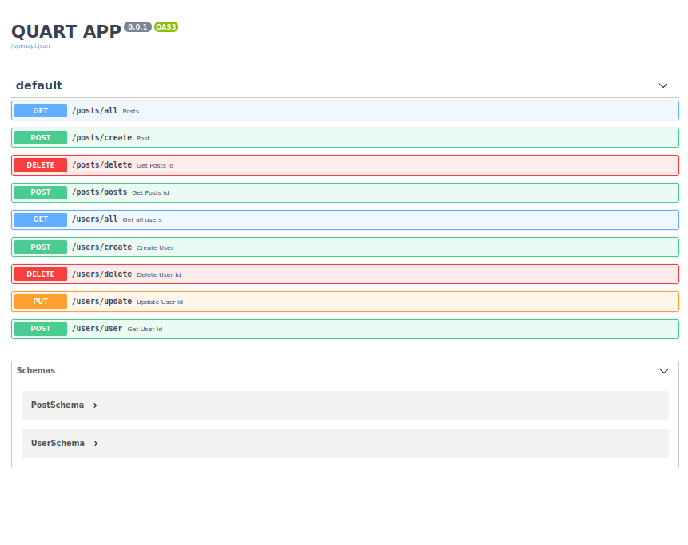
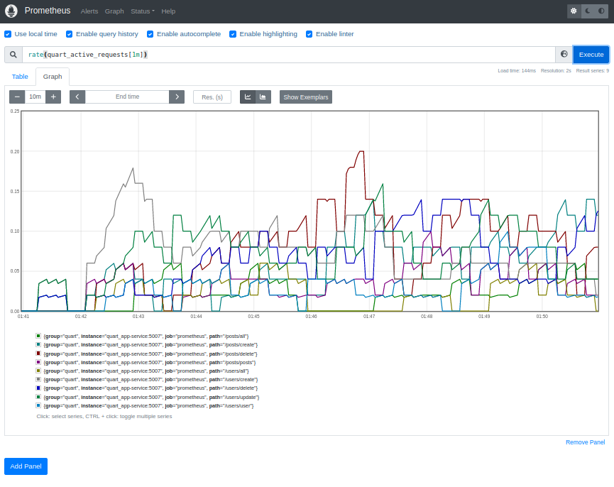

Quart app 
=========


### Venv:
###### python3.9
###### /
```
python -m venv quart_app/.venv && \
source quart_app/.venv/bin/activate && \
pip install -U pip && \
pip install -r quart_app/requirements.txt
```
### Run:
###### /
```
export QUART_APP=quart_app.app:app && \
export QUART_ENV=development && \
quart run -h "127.0.0.1" -p 5007
```
### Tests:
###### /
- ###### Molotov: 
  ```
  docker-compose up --build --detach && \
  sleep 5 && \
  molotov molotov-scenarios.py \
  --processes 5 \
  --workers 2 \
  --duration 600 && \
  docker-compose down && \
  docker rmi $(docker images --format="{{.ID}}" | head -n 1) --force
  ```
  - **Note:** 
    ```
    rate(quart_active_requests[1m])
    ```
    - ###### [Link](http://localhost:5007/) Swagger UI
    - ###### [Link](http://localhost:9090/) Prometheus

- ###### Test async:
    ````
    export QUART_APP=quart_app.app:app && \
    export QUART_ENV=development && \
    quart test-async
    ````
- ###### Init database:
    ````
    export QUART_APP=quart_app.app:app && \
    export QUART_ENV=development && \
    quart init-db
    ````
- ###### Test data access layer:
    ````
    export QUART_APP=quart_app.app:app && \
    export QUART_ENV=development && \
    quart test-dal
    ```` 
### Docker:
###### /quart_app
```
docker build -t quart_app . && \
docker run -it --rm -p 5007:5007 quart_app && \
docker rmi quart_app --force
```
**Note:** 
###### Help:
- ###### / inside root directory or cd /xxx  
###### [Links:]()
- ###### [Link](https://prometheus.io/docs/prometheus/latest/querying/basics/) Prometheus queries