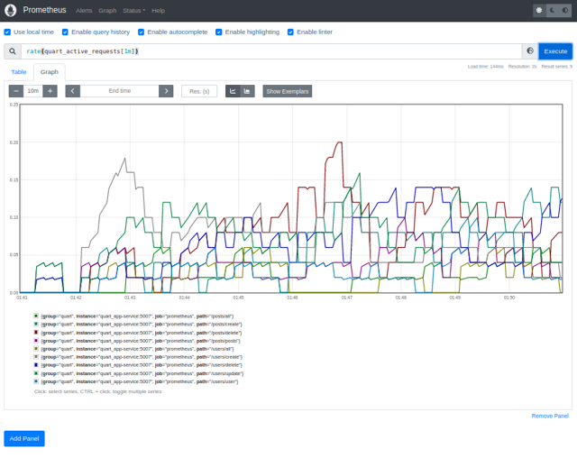

Quart app 
=========



###### venv: python3.9
###### /
```
python -m venv quart_sqlalchemy_app/.venv && \
source quart_sqlalchemy_app/.venv/bin/activate && \
pip install -U pip && \
pip install -r quart_sqlalchemy_app/requirements.txt
```
### Run:
###### /
```
docker-compose -f quart_sqlalchemy_app/docker-compose.yml up --build --detach && \
sleep 10 && molotov quart_sqlalchemy_app/molotov-scenarios.py \
  --processes 40 \
  --workers 20 \
  --duration 6000 && \
docker rmi $(docker images --format="{{.ID}}" quart_sqlalchemy_app_* | head -n 1) --force && \
docker rm $(docker ps -aq) --force && \
docker volume prune && \
docker network prune
```
**Note:**
###### query
```
rate(quart_active_requests[1m])
```
### Run:
```
docker run -p5432:5432 --name some-postgres \
  -e POSTGRES_PASSWORD=password -d postgres
sleep 10 && source quart_sqlalchemy_app/.venv/bin/activate && \
export QUART_APP=quart_sqlalchemy_app.app:app && \
export QUART_ENV=development && \
quart init-db && \
quart run -h "127.0.0.1" -p 5010
```
- ###### [pgadmin4](http://localhost:5555/)
```
docker run -p 5555:80 --name pgadmin \
    -e PGADMIN_DEFAULT_EMAIL="user@domain.com" \
    -e PGADMIN_DEFAULT_PASSWORD="12345" \
    -d dpage/pgadmin4
```
- ###### [prometheus](http://localhost:9090/)
###### query
```
docker run -p 9090:9090 \
    -v /fuul-path/users/prometheus.yml:/etc/prometheus/prometheus.yml \
    -d prom/prometheus
```
- ###### [users](http://localhost:5004/)
### Docker:
###### /users
```
docker build -t users . && \
docker run -it --rm -p 5010:5010 quart_sqlalchemy_app && \
docker rmi quart_sqlalchemy_app --force
```
### Tests:
###### /
- ###### Test async:
    ````
    export QUART_APP=quart_sqlalchemy_app.app:app && \
    export QUART_ENV=development && \
    quart test-async
    ````
- ###### Init database:
    ````
    export QUART_APP=quart_sqlalchemy_app.app:app && \
    export QUART_ENV=development && \
    quart init-db
    ````
- ###### Test data access layer:
    ````
    export QUART_APP=quart_sqlalchemy_app.app:app && \
    export QUART_ENV=development && \
    quart test-dal
    ````
- ###### Molotov: 
  ```
  molotov molotov-scenarios.py \
  --processes 5 \
  --workers 2 \
  --duration 600
  ```


**Note:** 
###### Help:
- ###### / inside root directory or cd /xxx  
###### [Links:]()
- ###### [Link](https://prometheus.io/docs/prometheus/latest/querying/basics/) Prometheus queries
- ###### [Link](http://localhost:5007/) Swagger UI
- ###### [Link](http://localhost:9090/) Prometheus