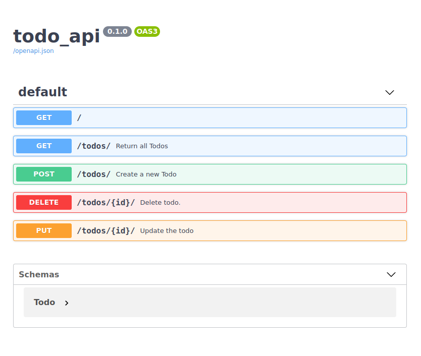

REST API with Quart & Postgres 
==============================

### Venv:
###### python3.9
###### /quartpostgressapp
```
python -m venv .venv && \
source .venv/bin/activate && \
pip install -U pip && \
pip install -r requirements.txt
```
### Run:
###### /
- ###### 1. )
```
docker run -p5432:5432 --name some-postgres \
  -e POSTGRES_PASSWORD=password -d postgres
```
- ###### 2. )
```
docker pull dpage/pgadmin4
docker run -p 80:80 \
    -e 'PGADMIN_DEFAULT_EMAIL=user@domain.com' \
    -e 'PGADMIN_DEFAULT_PASSWORD=password' \
    -d dpage/pgadmin4
```
- ###### 3. )
```
export QUART_APP=quartpostgresapp.app:app && \
export QUART_ENV=development && \
quart init-db && \
quart run -h "127.0.0.1" -p 5008
```
**Note:** Databases ...
```
pip install databases[postgresql]
pip install databases[mysql]
pip install databases[sqlite]
pip install databases[asyncpg]
pip install databases[aiopg]
pip install databases[aiomysql]
pip install databases[asyncmy]
pip install databases[aiosqlite]
```
###### Help:
- ###### / inside root directory or cd /xxx
###### [Links:]()
- ###### [Link]()